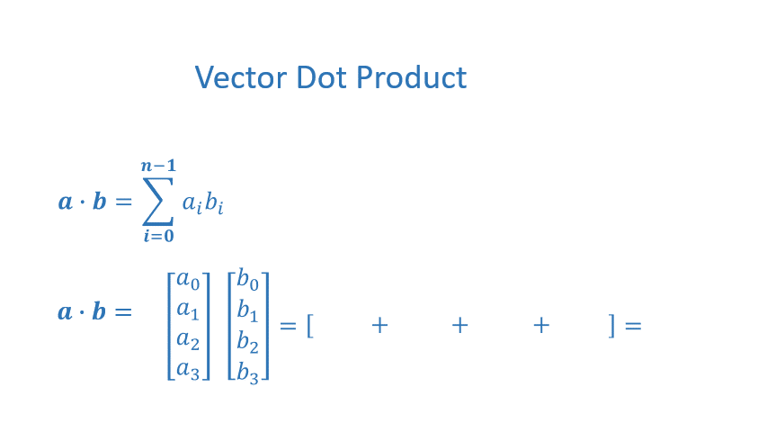

- [[deeplearning.ai/Supervised Learning/multiple-linear-regression]]
	- # Numpy vectorization
	  id:: 63f9774a-0cf1-4599-a174-0e62f96da117
		- ## Vectors
		  id:: c4c752c0-f57b-4a7f-ad8d-80e4c517c46f
		  collapsed:: true
			- Vectors are ordered arrays of numbers
			  id:: f063d717-9a3f-4671-b517-2d1d38f28318
			- The number of elements in a vector is their dimension, or rank
			  id:: 06f23fe6-7104-4601-a1ec-6c6a8b8d68b3
			- Index of a number in the vector is indicated by a subscript like $x_0$
			  id:: c10c763e-3e16-4de4-b542-3869cd4b3caa
			- ### Indexing
				- Get an element by position
				- `a[2]`
			- ### Slicing
				- Create an array using `start:stop:step` or a subset
				- ```python
				  #vector slicing operations
				  a = np.arange(10)
				  print(f"a         = {a}")
				  
				  #access 5 consecutive elements (start:stop:step)
				  c = a[2:7:1];     print("a[2:7:1] = ", c)
				  
				  # access 3 elements separated by two 
				  c = a[2:7:2];     print("a[2:7:2] = ", c)
				  
				  # access all elements index 3 and above
				  c = a[3:];        print("a[3:]    = ", c)
				  
				  # access all elements below index 3
				  c = a[:3];        print("a[:3]    = ", c)
				  
				  # access all elements
				  c = a[:];         print("a[:]     = ", c)
				  ```
			- ### Single vector operation
				- ```python
				  a = np.array([1,2,3,4])
				  # negate elements
				  b = -a 
				  
				  # sum all elements
				  b = np.sum(a) 
				  
				  # mean of array
				  b = np.mean(a)
				  
				  # multiply a by a scalar
				  b = 5 * a 
				  
				  # square each element 
				  b = a**2
				  ```
			- ### Multiple vector operations
				- arithmetical and comparison operations work on an element by element basis
				- Vectors must be the same size
				- ```python
				  a = np.array([ 1, 2, 3, 4])
				  b = np.array([-1,-2, 3, 4])
				  a+b
				  # [0 0 6 8]
				  ```
			- ### Dot Product
				- 
					- Multiplies elements in two vectors then sums their results
					- ```python
					  def my_dot(a, b): 
					      x=0
					      for i in range(a.shape[0]):
					          x = x + a[i] * b[i]
					      return x
					  ```
					- The built in `np.dot(a,b)` function is much faster
					- It uses SIMD to allow multiple operations to be done in parallel
			- ### Course 1 notation
			- Examples will be stored in a 2d matrix called x
			- w will be in a vector
			- Will index examples using `X[i]`
			- ```python
			  X = np.array([[1],[2],[3],[4]])
			  w = np.array([2])
			  c = np.dot(X[1], w)
			  ```
		- ## Matrices
			- Matrices are 2d arrays
			- Denoted by a capital bolded letter like **X**
			- usually, m is number or rows and n is columns
			- in 2d array, first index is code, second is column
			- 
			- In course 1, 2d matrices usually hold training data
			- The training data is m examples and n features
			- Usually an example is extracted, rather than doing operation directly on matrices
			- ### Matrix creation
				- `a = np.zeros((1, 5))`
				- Manualy specify: `a = np.array([[5], [4], [3]])`
			- ### Indexing
				- TODO look up `arange` and `reshape`
				- `A[2,0]`
				- `A[2]` accessing by row wil return a 1d vector
				- `A[0, 2:7:1]` gets 1d vector from row 2