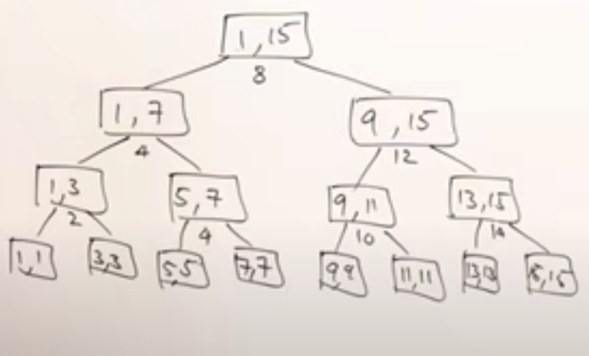

- [[abdul bari algorithms]]
	- [[abdul bari algorithms/quick sort]] [[quick sort]]
		- # Quick Sort Algorithm
		  collapsed:: true
			- {{video https://youtu.be/7h1s2SojIRw}}
			- {{youtube-timestamp 214}} An individual element is in a sorted position if all elements on the left hand side are smaller, and all the elements on the right side are greater.
			- Quicksort is a divide and conquer algorithm, meaning it splits the problem in to subproblems and solves them. 
			  id:: 63faca6e-e045-48a9-8654-d76754ceb9c8
			- Consider the following array: `[10,16,8,12,15,6,3,9,5]`
			- Set low and high indices at start and end of the list
			- {{youtube-timestamp 337}} select first element as the pivot, which is index 0 - `10`
			- We want to find the sorted position of 10, where all elements before are smaller, and all elements after are greater
			- {{youtube-timestamp 363}} start searching from `i` starting at index 0, the pivot
			- `i` will search for elements greater than 10, moving right
			- Take j starting at the end, moving left, which will search for elements smaller than the pivot, 10
			- This is called partitioning
			- {{youtube-timestamp 411}} Increment i until you find an element greater than 10
			- {{youtube-timestamp 414}} Decrement j until you find an element smaller than 10
			- Then exchange them
			- Continue, increment i until you find an element greater than pivot, and decrement j until you get an element smaller than pivot
			- Continue moving the high and low toward eachother until i crosses j. Don't increment them, and j becomes the position of the pivot
			- {{youtube-timestamp 498}} swap the position of the pivot into j. The pivot is in position, and the elements before and after are not sorted
			- {{youtube-timestamp 555}} Now do quick sort recursively on each side
			- ```js
			  function partition(a,low,high){
			    const pivot = a[l];
			    let i = low;
			    let j = high;
			    while (i < j){
			    do {
			      i++;
			    } while(a[i] <= pivot);
			    do {
			      j--;
			    }while (a[j]> pivot);
			    if (i < j){
			      swap(a[i],a[j]);
			    }
			    }
			        swap(a[low], a[j])
			  	  return j;
			  }
			  
			  function quickSort(a, low, high){
			    if (l < h){
			     const j = patition(a,low,high);
			      quickSort(a,low,j);
			      quickSort(j+1,high);
			    }
			  }
			  ```
		- # Quick Sort Analysis
			- {{video https://youtu.be/-qOVVRIZzao}}
			- Analyze quick sort [[time complexity]]
			- Suppose you have list of 15 elements
			- You start by calling quicksort with low index 1 and high index 15
			- Suppose partitioning is done in the middle
			- 
			- The complexity of partitioning is n, because it goes through the list (sometimes less)
			- Each level, the time taken is n for partitioning
			- The height of the tree is log(n)
			- {{youtube-timestamp 280}} So the time complexity is $n*log(n)$ in the best case, when the partitioning is always done in the middle
			- Very unlikely to achieve best case
			- Let's analyze the worst case complexity
			- {{youtube-timestamp 461}} What if the partitioning only happens at the beginning or end of the list?
			- 
			- Then the height of the list is n, and work done partitioning is n for each level
			- So the worst case time is $O(n^2)$, when the list is already sorted
			- [[merge sort]] is always $O(log(n)$
			- {{youtube-timestamp 570}} How to improve this? Don't always select the first element as pivot
			- You could select the middle element of the pivot
			- {{youtube-timestamp 632}} You can also select a random element as the pivot
			- TODO Research random vs middle element
			- Quicksort doesn't use extra space, but does use the stack