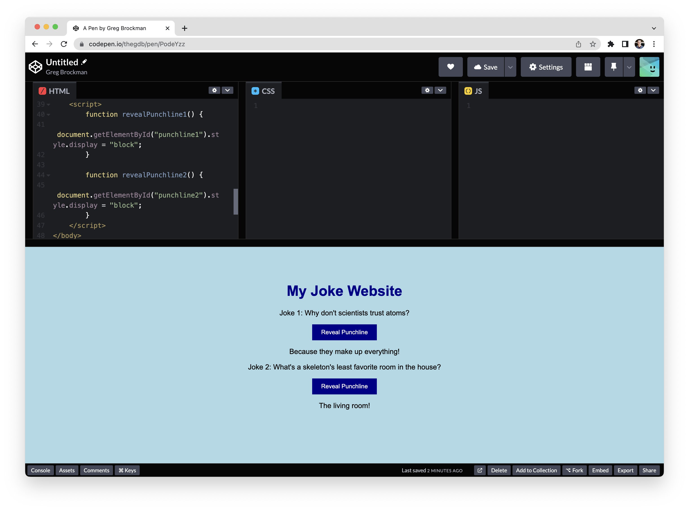
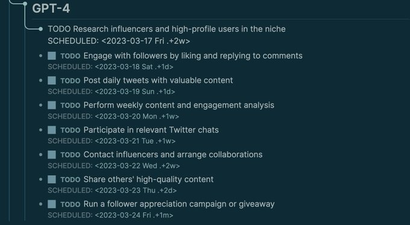

- [[newsletter]]
	- [[chatgpt vs gpt-3]]
		- gpt-3.5-turbo
		- text-davinci-003
		- Write a detailed 1 year curriculum to learn AI
		  collapsed:: true
			- Year 1 Curriculum for Learning AI:
			  
			  Month 1-2: Fundamentals of Programming Languages
			  • High-level programming languages vs low-level programming languages
			  • Basic programming concepts
			  • Syntax and data types
			  • Conditional statements and loops
			  • Basic Data Structures and Functions
			  • Exercises and Projects
			  
			  Month 3-4: Mathematics for AI
			  • Linear Algebra
			  • Probability and Statistics
			  • Calculus
			  • Optimization Visualization 
			  • Exercises and Projects
			  
			  Month 5-6: Machine Learning Fundamentals
			  • Introduction to Machine Learning
			  • Linear Regression, Logistical Regression, K-Nearest Neighbors, and Decision Trees algorithms
			  • Understanding Data and Preprocessing
			  • Feature Engineering and Feature Selection
			  • Evaluation Techniques and Metrics
			  • Exercises and Projects
			  
			  Month 7-8: Deep Learning
			  • Neural Networks
			  • Convolutional Neural Networks
			  • Recurrent Neural Networks
			  • Convolutional and Deep Neural Networks
			  • Introductory Computer Vision 
			  • Transfer Learning
			  • Exercises and Projects
			  
			  Month 9-10: Natural Language Processing
			  • Text Preprocessing 
			  • Language Models 
			  • Specified Deep Learning Techniques 
			  • Word Vector Representation 
			  • Text Classification and Sentiment Analysis
			  • Exercises and Projects
			  
			  Month 11-12: Advanced Topics 
			  • Reinforcement Learning 
			  • Generative Adversarial Networks 
			  • Autoencoders 
			  • Model Optimization Techniques 
			  • Deployment 
			  • Capstone Project
			  
			  Through this Curriculum, learners will gain knowledge of programming, mathematics, machine learning, deep learning, natural language processing, reinforcement learning, generative adversarial networks, model optimization techniques, deployment, and real-world applications.
			- Below is a 1-year curriculum to learn AI: 
			   
			  Q1: 
			  ● Introduction to AI (1 month): taking an introductory course into AI and learning the basics of AI such as computer vision, natural language processing, machine learning and related topics. 
			   
			  Q2: 
			  ● Mathematical Foundations of AI (2 months): this includes an in-depth study of Linear Algebra, Multivariable Calculus, Probability Theory, and Optimization Theory. 
			  
			  Q3:
			  ● Programming Fundamentals (1 month): this includes a review of fundamental programming concepts, such as data structures and algorithms, as well as software engineering best practices. 
			  
			  Q4: 
			  ● Machine Learning (2 months): this includes an in-depth study of different types of machine learning algorithms such as supervised learning, unsupervised learning, and reinforcement learning. 
			  
			  Q5: 
			  ● Deep Learning (2 months): this includes a study of the foundations of deep learning and learning how to implement a variety of neural networks, including convolutional neural networks and recurrent neural networks. 
			  
			  Q6: 
			  ● AI Applications (1 month): this includes learning how to develop and deploy AI applications, such as computer vision and natural language processing applications. 
			  
			  Q7: 
			  ● AI Projects (2 months): this involves working on several AI projects from start to finish, using the knowledge gained throughout the course.
		- Write flashcards for studying mathematics for AI formatted as a markdown table
		- Write flash cards for studying mathematical notation for AI formatted as a markdown table
		  collapsed:: true
			- | Term | Definition |
			  | --- | --- |
			  | Artificial Intelligence | The simulation of human intelligence in machines that are programmed to think and learn like humans. |
			  | Machine Learning | A branch of AI that enables machines to learn from data and improve their performance over time without being explicitly programmed. |
			  | Deep Learning | A type of machine learning that uses neural networks to analyze complex patterns in data, such as images, speech, and language. |
			  | Neural Network | A set of algorithms modeled after the human brain that enable machines to recognize and analyze patterns in data. |
			  | Natural Language Processing | A branch of AI that deals with the interactions between computers and human languages, allowing machines to understand and interpret human language. |
			  | Robotics | A field of engineering and computer science that deals with designing, building, and operating robots that can perform tasks autonomously or with minimal human intervention. |
			  | Computer Vision | A branch of AI that enables machines to interpret and analyze visual data from the world around them, such as images and videos. |
			  | Expert Systems | AI systems that mimic the decision-making abilities of a human expert in a particular field by using a knowledge base and set of rules. |
			  | Reinforcement Learning | A type of machine learning where an agent learns to make decisions in an environment by receiving feedback in the form of rewards or penalties. |
			- | Notation | Description |
			  |----------|-------------|
			  | $x$      | Variable representing a scalar |
			  | $\boldsymbol{x}$ | Variable representing a vector |
			  | $\mathbf{X}$ | Variable representing a matrix |
			  | $\boldsymbol{\Theta}$ | Variable representing model parameters |
			  | $\mathbb{R}$ | The set of real numbers |
			  | $=,\neq,\approx$ | Equality, inequality, approximates |
			  | $\leq, \geq$ | Less than or equal to, greater than or equal to |
			  | $\min, \max$ | Minimum, maximum |
			  | $\arg\min, \arg\max$ | Argument that minimizes or maximizes a function |
			  | $\sum_{i=1}^{n} x_i$ | Sum of $x_i$ from $1$ to $n$ |
			  | $\prod_{i=1}^{n} x_i$ | Product of $x_i$ from $1$ to $n$ |
			  | $\frac{\partial f}{\partial x}$ | Partial derivative of $f$ with respect to $x$ |
			  | $\nabla_x f$ | Gradient of $f$ with respect to $x$ |
			  | $f(x)$ | Function $f$ evaluated at $x$ | 
			  | $f:\mathbb{R}\to\mathbb{R}$ | Function $f$ maps from real numbers to real numbers |
			  | $P(x)$ | Probability of $x$ | 
			  | $\mathbb{E}[X]$ | Expected value of random variable $X$ | 
			  | $\mathbb{V}[X]$ | Variance of random variable $X$ | 
			  | $\mathbb{C}[X,Y]$ | Covariance of random variables $X$ and $Y$ |
			  | $X\sim D$ | Random variable $X$ follows distribution $D$ | 
			  | $x_i$ | $i$th element of vector $\boldsymbol{x}$ or $i$th row of matrix $\mathbf{X}$| 
			  | $x_j^{(i)}$ | $j$th element of vector $\boldsymbol{x}^{(i)}$ or $j$th column of matrix $\mathbf{X}^{(i)}$| 
			  | $\langle \boldsymbol{x}, \boldsymbol{y} \rangle$ | Dot product of vectors $\boldsymbol{x}$ and $\boldsymbol{y}$| 
			  | $\boldsymbol{x}^T\boldsymbol{y}$ | Transpose of vector $\boldsymbol{x}$ times vector $\boldsymbol{y}$| 
			  | $\mathbf{XY}$ | Matrix multiplication of $\mathbf{X}$ and $\mathbf{Y}$ |
			  | $\mathbf{X}^{-1}$ | Inverse of matrix $\mathbf{X}$ |
			  | $\det(\mathbf{X})$ | Determinant of matrix $\mathbf{X}$ | 
			  | $p(y|x)$ | Conditional probability of $y$ given $x$ | 
			  | $y = f_\boldsymbol{\Theta}(x)$ | Model $f$ with parameters $\boldsymbol{\Theta}$ predicts $y$ from input $x$ |
			  | $\mathcal{L}(\boldsymbol{\Theta})$ | Loss function of model with parameters $\boldsymbol{\Theta}$ | 
			  | $f^\prime(x)$ | Derivative of function $f$ with respect to $x$ |
			  | $\triangleq$ | Defined as |
			-
		- Write the beginning of a dark fantasy novel
		  collapsed:: true
			- In a land far beyond the reach of mortal men, where the skies were forever the color of an impending storm, a great evil lurked. It slithered and crept through the shadows of the twisted, gnarled trees, and its eyes gleamed with an ominous, other-worldly glow that seemed to pierce the very souls of those who dared to look upon it.
			  
			  The villagers of the small hamlet that lay nearby spoke of this evil in hushed whispers, afraid that even uttering its name aloud would summon it forth from its hiding place. They knew, however, that it was there, and it watched them, waiting for the right moment to strike.
			  
			  No one knew where this evil had come from, nor did anyone know why it had set its sights on their humble village. But they all knew one thing for certain: it was coming for them, and they would be powerless to stop it.
			  
			  As the days grew shorter and the nights grew longer, the villagers began to hear strange whispers on the wind. They could not understand the words that were being spoken, but they could feel the malice behind them. And they knew that it was only a matter of time before the evil would reveal itself once and for all, and they would be forced to face the darkness that had consumed their land.
	- # Student Teacher Dialog
	    prompt-template:: Student Teacher Dialog
		- ``` prompt
		  Rewrite text as a dialog between a teacher and a student:
		  	  ```
	- [[newsletter/issue-12]]
		- ## GPT-4
			- OpenAI just released an even new model GPT-4, which I recently integrated into my Logeq OpenAI plugin (You do need a GPT-4 private beta key to use it until it's released publicly)
			- I've been testing GPT-4, and the results are really impressive. It gives much more nuanced and detailed answers than earlier models.
			- In my tests, it's capable of more complex tasks that weren't possible before.
			- A notable improvement is the new GPT-4 model has a much greater "context length," which was a massive limitation of earlier models.
			- The "context length" controls how much text input and instructions the model can understand, as well as how much text it can generate.
			- Before, you were limited to around 6 pages of input and output text in total. Now, you can generate and analyze a total of 50 pages of text.
			- This opens up so many new possibilities, such as feeding entire research papers or legal cases in and answering questions about it, or generating a 50 page film screenplay.
			- Not only is the model "smarter" in general, but feeding in a ton of additional context and instructions makes it much, much more capable.
			- ### OpenAI Demo
				- In OpenAI's examples, they show it taking a number of human standardized tests like the AP Chemistry test and Bar Exam (that lawyers need to pass to practice law)
				- GPT-4 passes the bar exam with a score around the top 10% of test takers; in contrast, GPT-3.5 (ChatGPT), which was released ~3 months ago, had a score in the bottom 10%.
				- 
				- Another notable feature is that GPT-4 is "multimodal", meaning it can understand images as well as text.
				- In one of their demos, they drew a napkin sketch of a website, and GPT-4 turned it into a working website
				- > Write brief HTML/JS to turn this mock-up into a colorful website, where the jokes are replaced by two real jokes
				- Hand drawn image he uploaded from his notebook
				- It's for a joke website, where it shows a joke, and you push a button to reveal the punchline.
				- 
				- GPT-4 was able to completely code this website, including the content, styling, and code to reveal the punchline when you push the button.
				- 
				- Watch the full demo here:
				- {{video https://www.youtube.com/watch?v=outcGtbnMuQ}}
			- ### GPT-4 in the Logseq OpenAI plugin
				- Generating plans and systems with GPT-4 and Logseq
				- When testing the new API, I found GPT-4 was able to certain complex tasks that ChatGPT was not able to accomplish at all. Here's one concrete example:
				- One of my favorite features in logseq is the repeating checkbox tasks. You can create a checkbox that repeats at specified intervals using Logseq-specific markdown syntax.
				- Here's an example of a task reminding you to tweet and the format in plain text.
				- 
				- When you write text in the format above, a checkbox appears in your notes. When you click the checkbox, it reappears a day later. You can specify these tasks to be at any interval: weekly, bimonthly, yearly, etc
				- {:height 95, :width 399}
				- With GPT-4, you can give it one example of the Logseq task syntax, along with a  command like "Create a plan for me to gain followers on Twitter using Logseq repeating tasks" and it will generate a detailed plan of what tasks you need to do and how frequently you need to do them.
				- 
				- In this example, to gain Twitter followers, the AI suggests you tweet daily, reply to others daily, check your metrics weekly, share others' content every other day, etc.
				- So to gain followers, you just need to execute the plan that the AI gave you, doing the task, checking the box, and doing it again when the task repeats itself at the interval the AI chose.
				- When I gave the same task to ChatGPT, released just 6 months ago, it couldn't do it.
				- I'm really fascinated by the idea of AI generating plans for humans to follow and acting as their personal assistant, and I want to explore this idea more in the future.
				- In another example, I asked it to write me a college-style curriculum to learn AI in a year, and it did a beautiful job. My main use case for AI is using it to self-study various subjects, and I'm really excited about the possibilities AI opens up for self-directed learners.
		- ## ChatGPT API
			- OpenAI also recently released its ChatGPT API.
			- I upgraded the Logseq OpenAI plugin to support this as well.
			- The most notable thing about the ChatGPT API is its price. OpenAI has stated that it is 90% cheaper than other models, such as GPT-4 or GPT-3.
			- Before, I was spending around \$7 a month with moderate usage of GPT-3 for notetaking, but now I'm spending less than 1\$ per month using ChatGPT.
			- If you can make ChatGPT work for your use case, you should consider using it because it's so much cheaper and faster than the other models and is so much more affordable. For example, for summarizing short text, ChatGPT does a great job.
			- GPT-4 has better quality answers, but is much more expensive
			- Although the name "chat" might suggest a conversational use case, OpenAI claims that the ChatGPT API is as good as GPT-3 model for non-chat use cases and single actions tasks such as summarizing an article. They recommend using the ChatGPT API instead of the earlier models for most use cases.
			- The output is very similar to previous models, but the biggest improvement I've noticed is it's less likely to make up or "hallucinate" answers.
			- In one of OpenAI's examples, they show that if you ask it a nonsensical question like:
			- > Tell me about when Christopher Columbus came to the US in 2015
			- ChatGPT will identify that the question doesn't make sense, but GPT-3 will make up a story about Christopher Columbus arriving in 2015.
			- In one of my tests I ask it to:
			- > Describe yoda from star wars
			- 
			- ChatGPT describes him accurately, however GPT-3 often gets details wrong, such as describing him as having a "long pointed beard"
			- I tested this with other fictional characters, and ChatGPT consistently gets the details correct, and GPT-3 very often adds incorrect details.
			- There are some downsides compared to regular GPT-3. Although OpenAI claims ChatGPT is suitable for non-chat tasks and a replacement for regular GPT-3, it still often inserts conversational dialog like "Okay! here you go!", whereas regular GPT-3 would directly answer the questions.
			- I reduced this tendency by adding instructions via a "System Message," a parameter used to guide ChatGPT's responses, but it still happens occasionally.
			- > Do not refer to yourself in your answers. Do not answer in a conversational way. Do not say as an AI language model.
			- Overall, the answers are a bit better, and users of the Logseq OpenAI GPT-3 plugin can expect to spend 90% less while still receiving quality results.
	-