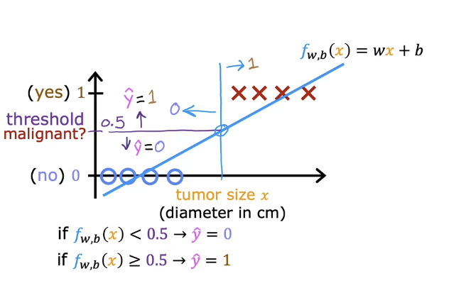
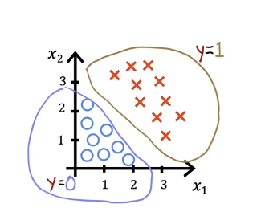
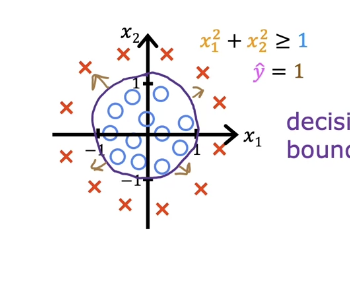
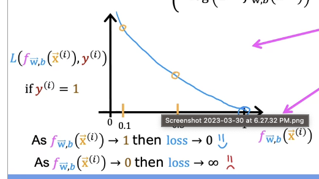
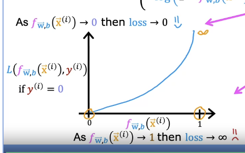
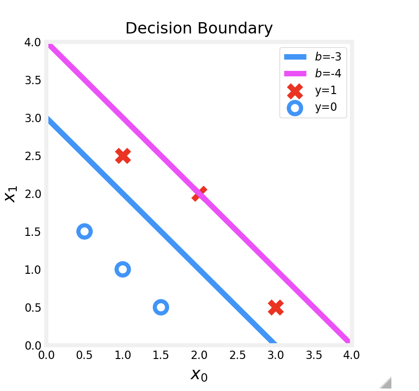
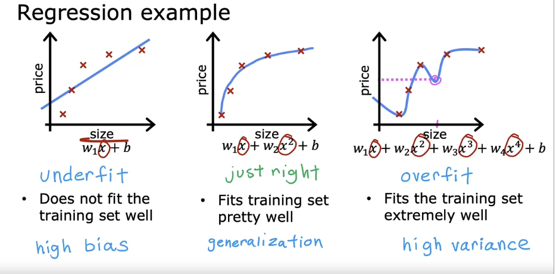
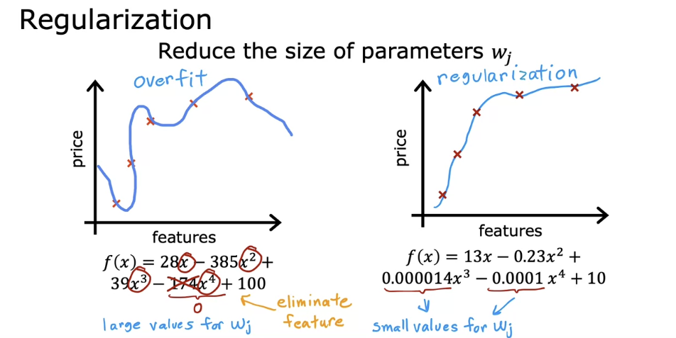
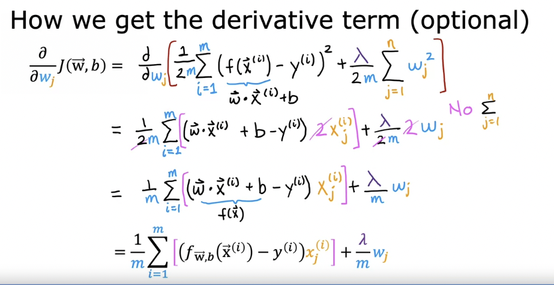

tags:: [[ai]]

- # Classification with logistic regression
	- Linear regression predicts a number
	- Classification is where y can only take on a handful of algorithms
	- Examples of classification problems
		- Is this email Spam? yes/no
		- Is the transaction fraudulent?
	- Binary classification is true/false
	- False is also called negative class, and true is called positive class
	- Consider a training set to determine if a tumor is malignant
	- You could plot your data, make a linear regression line, and a threshold
	- Plotting this, we plot malignant at y=1 and benign at 0
	- If the model outputs a value greater than the threshold value, consider it malignant
	- 
	- If we have outliers to the right, the dividing line, or decision boundary can shift too far right
	- Note: even though the name logistic regression has the word regression in it, it's used for binary classification
	- ## Classification lab
		- One variable vs two variable plot
		- 
		- In the first plot, positive results are red x and at y=1, negative results are blue O's at y=0
		- With linear regression, the values could have been anything, but with logistic regression, it's 0 or 1
		- The second graph shows shows two variables, where y is not available
		- This is when the model takes two things into account, for example, the first one may just look at size
		- A similar plot in linear regression would be 3 dimensional
	- ## Logistic Regression
		- Logistic regression will fit an s shaped curve.
		- {:height 325, :width 587}
		- ### Sigmoid function
			- Also called logistic function
			- The sigmoid function looks like this, where 0 is in the middle, unlike the last graph
			- 
			- $g(z)=\frac{1}{1+e^{-z}}$ which ranges between 0 and 1
			  id:: 640d5c6c-c03c-4d14-9789-c9af611ba2ab
			- When z is large, g(z) is about 1
			- When z is a small negative number, it's approzamately zero
			- When z=0, g(z) is about .5
			- ### Explaining Sigmoid function
				- remember $f_{\vec{w},b}(\vec{x})$
				- store this function in in $z$ where $z=\vec{w} \cdot \vec{x} + b$
				- Next step, pass value of z to sigmoid function
				- $g(z)=\frac{1}{1+e^{-z}}$
				- When you put these equations together, you get the logistic regression model
				- Fully expanded out logistic regression model is:
				- $f_{\vec{w},b}(\vec{x})=\frac{1}{1+e^{-(\vec{w} \cdot \vec{x} + b)}}$
				- This function inputs  the feature x, and outputs a number between 0 and 1
			- Think of logistic regression output as the probability the output will be 1
			- If you are predicting tumor, and the output is .7, then it means there's a 70% chance of being 1
			- So there's a 70% chance that it's malignant
			- What is the chance that it's not malignant?
			- It must be zero or one, so the numbers must add up to one: $P(y=0)+P(y=1)=1$
			- You may see this notation when reading about logistic regression
				- $f_{\vec{w},b}(\vec{x})=P(y=1|\vec{x};\vec{w},b)$
				- This means "probability of y=1, given the input feature x, and parameters w and b"
				- The semicolon means w and b are parameters that affect the computation, given the input $\vec{x}$
	- ## Logistic Regression Lab - Sigmoid function
		- We start by using our linear regression model $f_{\mathbf{w},b}(\mathbf{x}^{(i)}) = \mathbf{w} \cdot  \mathbf{x}^{(i)} + b$, to predict $y$ given $x$
		- Since we're doing classifications, we want our output to be either 0 or 1
		- We can use the sigmoid function to map all input values to values between 0 and 1
		- The sigmoid function formula is $g(z) = \frac{1}{1+e^{-z}}$
		- The input z can be a single scalar value or a vector containing multiple values, and our implementation needs to cover both
		- numpy has a function `exp()` which allows you to calculate the exponential $e^z$ in input array z
			- #### vector input to `exp`
				- ```python
				  # Input is an array. 
				  input_array = np.array([1,2,3])
				  exp_array = np.exp(input_array)
				  #output exp_array = [ 2.72  7.39 20.09]
				  ```
			- #### Scalar input to `exp`
				- ```python
				  # Input is a single number
				  input_val = 1  
				  exp_val = np.exp(input_val)
				  # output exp_val = 2.7182
				  ```
		- ### Sigmoid Implementation
			- ```python
			  def sigmoid(z):
			      """
			      Compute the sigmoid of z
			  
			      Args:
			          z (ndarray): A scalar, numpy array of any size.
			  
			      Returns:
			          g (ndarray): sigmoid(z), with the same shape as z
			           
			      """
			  
			      g = 1/(1+np.exp(-z))
			     
			      return g
			  ```
		- 
		-
	- ## Decision Boundary
		- Remember how the logistic regression is computed
			- Compute $f_{\vec{w},b}(\vec{x})$ as  $z$ where $z=\vec{w} \cdot \vec{x} + b$
			- Fully expanded is $f_{\vec{w},b}(\vec{x})=\frac{1}{1+e^{-(\vec{w} \cdot \vec{x} + b)}}$
			- And you interpret this as the probability that y=1, given $\vec{x}$, and parameters $\vec{w}$ and $b$
				- $f_{\vec{w},b}(\vec{x})=P(y=1|\vec{x};\vec{w},b)$
			- This would be something like 0.7 or 0.3
		- You can set a threshold of something like 0.5, then you predict $\hat{y}$=1 / yes when greater than .5, or $\hat{y}$=0, no when less than .5
		- When is $g(z)$ /  $f_{\vec{w},b}(\vec{x})$ greater than .5? when $z$ is greater than 0
		- When is z greater than 0? Whenever $z=\vec{w} \cdot \vec{x} + b > 0$
		- 
		- In this example we have two features
		- Lets assume weights w are 1 and b is -3
		- $f_{\vec{w},b}(\vec{x})=g(z)=g(w_1x_1+w_2x_2+b)$
		- Consider when $z=\vec{w} \cdot \vec{x} + b$
		- This is where we're neutral if the value is 0 or 1
		- In this case, when w weights are 1, we can find the values of x where $z=0$
		- $z=x_1+x_2-3=0$
		- $x_1+x_2 = 3$
		- This corresponds to this line, which is called the decision boundary
		- Values to the right are predicted to be 1, and to the left are 0
		- 
		- ### Non linear decision boundary
			- What happens when the decision boundary isn't a straight line?
			- You can use polynomials
			- Consider $g(z)=g(w_1{x_1}^2+w_2{x_2}^2+b)$
			- Decisision boundary is:
				- ${x_1}^2+{x_2}^2 = 1$
				- This looks like a circle
				- 
			- Can also be an ellipse, or even something more complicated, like a complex shape
- # Cost function for Logistic Regression
	- This is an example of training data for classifications
	- Includes n features, and the prediction is 0 or 1 for each of them
	- |Tumor Size|... more features|Patient Age|Malignant?|
	  |--|--|--|--|
	  |10||52|1|
	  |2||73|0|
	  |5||55|0|
	  |12||49|1|
	- Features may be $x_1$ through $x_n$
	- How can we choose parameters w and b, the weights
	- Remember the squared cost error function for linear regression
		- $J(w,b) = \frac{1}{n}\sum_{i=1}^{n}\frac{1}{2}(f_{w,b}(x^{(i)}) - y^{(i)})^2$
	- Plotting the cost function for logistic regression shows a non convex graph
	- This makes gradient descent difficult because you can get stuck in local minima
	- 
	- Let's change the cost function definition a bit
	- Let's take the cost function above and call it the Loss function, with capital L
	- $L(f_{w,b}(x^{(i)}) , y^{(i)})$
	- Logistic loss function
	- $$loss(f_{\mathbf{w},b}(\mathbf{x}^{(i)}), y^{(i)}) = \begin{cases}
	  -\log\left(f_{\mathbf{w},b}\left( \mathbf{x}^{(i)} \right) \right) & \text{if $y^{(i)}=1$}\\
	  -\log \left( 1 - f_{\mathbf{w},b}\left( \mathbf{x}^{(i)} \right) \right) & \text{if $y^{(i)}=0$}
	    \end{cases}$$
	- Here's what it looks like if you plot log and negative log
	- 
	- Since the loss function only is between 0 and 1, so that's all we care about
	- 
	- So if it predicts a high certainty of 0, and it's actually 1, then the loss is very large
	- 
	- With this, the overall cost function will be convex, so you can use gradient descent reliably
- ## simplified cost function for logistic regression
	- We will see a simpler way to write the loss and cost functions so the implementation is simpler for gradient descent
	- Remember the loss function from the previous video
	- $$loss(f_{\mathbf{w},b}(\mathbf{x}^{(i)}), y^{(i)}) = \begin{cases}
	  -\log\left(f_{\mathbf{w},b}\left( \mathbf{x}^{(i)} \right) \right) & \text{if $y^{(i)}=1$}\\
	  -\log \left( 1 - f_{\mathbf{w},b}\left( \mathbf{x}^{(i)} \right) \right) & \text{if $y^{(i)}=0$}
	    \end{cases}$$
	- We're doing binary classification, so y is 0 or 1
	- y can only be 1 or zero
	- $$loss(f_{\mathbf{w},b}(\mathbf{x}^{(i)}), y^{(i)}) = -y^{(i)} \log\left(f_{\mathbf{w},b}\left( \mathbf{x}^{(i)} \right) \right) - \left( 1 - y^{(i)}\right) \log \left( 1 - f_{\mathbf{w},b}\left( \mathbf{x}^{(i)} \right) \right) $$
	- This equation is equivalent to the one above
	- Why is this the case?
	- y can only be either 1 or 0
	- If y = 1
	  collapsed:: true
		- On the right side, when y =1 , 1-y =0, so the right part of the function goes away
		- And we just have
		- $$loss(f_{\mathbf{w},b}(\mathbf{x}^{(i)}), y^{(i)}) = -1\log\left(f_{\mathbf{w},b}\left( \mathbf{x}^{(i)} \right) \right) $$
		- Which is the same as the 1 case above
	- if y = 1
	  collapsed:: true
		- The term on the left is multiplied by 0, so it goes away, and becomes the second case from on top
		- $$\left( 1 - 0\right) \log \left( 1 - f_{\mathbf{w},b}\left( \mathbf{x}^{(i)} \right) \right) \tag{2}$$
		- $$\log \left( 1 - f_{\mathbf{w},b}\left( \mathbf{x}^{(i)} \right) \right) \tag{2}$$
	- ### Cost function
		- Let's plug the new equation into the cost function
		- $$ J(\mathbf{w},b) =- \frac{1}{m} \sum_{i=0}^{m-1} y^{(i)} \log\left(f_{\mathbf{w},b}\left( \mathbf{x}^{(i)} \right) \right) +\left( 1 - y^{(i)}\right) \log \left( 1 - f_{\mathbf{w},b}\left( \mathbf{x}^{(i)} \right) \right)$$
		- (we brought the negative sign out, and swapped the plus in the middle because of that)
		- Why did we choose this function, instead of other cost functions?
		- This is derived from statistics using maximum maximum liklihood estimation
		- Remember, loss applies to one example, and cost applies to all examples, which is where you combined all the losses
- ## Logistic Regression cost function lab
	- ```python
	  def compute_cost_logistic(X, y, w, b):
	      """
	      Computes cost
	  
	      Args:
	        X (ndarray (m,n)): Data, m examples with n features
	        y (ndarray (m,)) : target values
	        w (ndarray (n,)) : model parameters  
	        b (scalar)       : model parameter
	        
	      Returns:
	        cost (scalar): cost
	      """
	  
	      m = X.shape[0]
	      cost = 0.0
	      for i in range(m):
	          z_i = np.dot(X[i],w) + b
	          f_wb_i = sigmoid(z_i)
	          cost +=  -y[i]*np.log(f_wb_i) - (1-y[i])*np.log(1-f_wb_i)
	               
	      cost = cost / m
	      return cost
	  ```
	- 
	- Comparing the cost of where the weights are [1,1] but one graph has an intercept of -3 and the other -4
	- If we put both of these into the function, we can see that the cost is higher for -4, so it's worse
- #  Gradient Descent
	- ## Gradient descent implementation
		- How do we find a good choice of parameters w and b
		- Remember
		- This is the model that makes the predictions
		- given x, predict the probability y is 1
		- $f_{\vec{w},b}(\vec{x})=\frac{1}{1+e^{-(\vec{w} \cdot \vec{x} + b)}}$
		- This is the cost function for the model
		- $$ J(\mathbf{w},b) =- \frac{1}{m} \sum_{i=0}^{m-1} y^{(i)} \log\left(f_{\mathbf{w},b}\left( \mathbf{x}^{(i)} \right) \right) +\left( 1 - y^{(i)}\right) \log \left( 1 - f_{\mathbf{w},b}\left( \mathbf{x}^{(i)} \right) \right)$$
		- Gradient descent is a method of minimizing the cost function
		- Remember gradient descent
		- $$\begin{align*} \text{repeat}&\text{ until convergence:} \; \lbrace \newline\;
		  & w_j = w_j -  \alpha \frac{\partial J(\mathbf{w},b)}{\partial w_j}  \; & \text{for j = 0..n-1}\newline
		  &b\ \ = b -  \alpha \frac{\partial J(\mathbf{w},b)}{\partial b}  \newline \rbrace
		  \end{align*}$$
		- Using calculus, we can show the derivative with respect to w
		- $$\frac{\partial J(\mathbf{w},b)}{\partial w_j}  = \frac{1}{m} \sum\limits_{i = 0}^{m-1} (f_{\mathbf{w},b}(\mathbf{x}^{(i)}) - y^{(i)})x_{j}^{(i)}$$
		-
		- $$\frac{\partial J(\mathbf{w},b)}{\partial b}  = \frac{1}{m} \sum\limits_{i = 0}^{m-1} (f_{\mathbf{w},b}(\mathbf{x}^{(i)}) - y^{(i)})$$
		- Remember We need to do simultaneous updates
		- They look exactly the same as linear regression
		- However, it's not linear regression because the f(x) definition is different
		- In this case, we're using the sigmoid function in this case, instead of the dot product plus intercept
- # Overfitting
	- Overfitting is when the model fits the training data perfectly, but doesn't do well on unseen data
	- 
	- Underfit means it doesn't fit the training data well, also known as "high bias"
	- Overfit is when it fits the training data very well, but has a high variance on unseen data
	- ## How to fix overfitting
	  collapsed:: true
		- Use more data
		- See if you can use fewer features
			- Choosing the most appropriate set of features to use is also called feature selection
			- One downside is only by using a subset of features, you're throwing away some of the information
			- There are algorithms for automatically choosing the most appopriate features
		- ### Regularization
			- Reduce the size of the parameters
			- Often the features are pretty large
			- Setting a parameter to 0 eliminates the feature
			- But you might want to set it really low instead of 0
			- Regularization is a way of shrinking the values, without setting it to 0
			- 
			- Regularization letsyou keep the features, but prevents them from having too much of an effect
			- Usually it's fine to regularize the features w, but you don't need to regularize b
	- ## Cost function with regularization
		- Regulariztaion tries to make the weights small to avoid overfitting
		- We saw that high order polynomials could overfit data
		- What if we could make some of the weights for the higher order polynomial small?
		- We could update the cost function to add some of the weights on this outside
		- This minimizes the cost function, because the model needs to make these weights on the outside really small
		- 
		- If all the parameters could be large, you can wind up with a really wiggly line
		- Last time, we only penalized or regularized w3 and w4
		- However, you might not know which are the most important features and which ones to penalize
		- Generally, we penalize all the features, all the wj parameters
		- This usually results in fitting a smoother simpler line
		- For predicting housing prices, we may have 100 features
		- To penalize the features, we can add a new function lambda, also called a regularization parameter
		- Similar to choosing a learning rate alpha, we have to pick lambda, where lambda > 0
		- We scale both terms by lambda/2m , by scaling both terms the same way, it's easier to choose a good value for lambda
		- ### Regularization Parameter
			- $$J(\vec{w},b) = \frac{1}{2m} \sum_{i=1}^{m} (f_{\vec{w},b}(\vec{x}^{(i)}) - y^{(i)})^2 + \frac{\lambda}{2m} \sum_{j=1}^{n} w_j^2$$
		- Examples
			- If lambda is 0, you don't use it and you overfit
			- If lambda is huge, like 10^10, so almost all the values of w are close to 0, and the model will underfit
			- We need a value of lambda that balances lowering the square error, and keeping the parameters relatively small
			- We will see later how to choose good models with lambda
	- ## Regularized Linear Regression
	  collapsed:: true
		- How to get gradient descent to work with linear regression
		-
		- This is the cost function for linear regression
		- $$J(\vec{w},b) = \frac{1}{2m} \sum_{i=1}^{m} (f_{\vec{w},b}(\vec{x}^{(i)}) - y^{(i)})^2 + \frac{\lambda}{2m} \sum_{j=1}^{n} w_j^2$$
		- We want to minimize the cost function
		- Before we added lambda, we were using gradient descent
		- Before we updated the weights based on the gradient descent algorithm
		- ((63fc3fab-4eb6-4ab7-ada2-3eb3bb8afee1))
		- ((63ca5105-a634-4e43-a44c-0b7607724217))
		-
		- ((63ca5105-103e-460b-93d6-1371828893da))
		- New gradient descent algorithms with regularization
			- $$\frac{\partial}{\partial w}J(w,b)  = \frac{1}{n}\sum_{i=1}^{n}(f_{w,b}(x^{(i)}) - y^{(i)})x^{(i)} + \frac{\lambda}{m}w_j$$
			- We don't regularize b, so the b derivative remains the same
			- We can rewrite this
			- 
			- Looking at this left size
			- $\alpha\frac{\lambda}{m}$
			- m is the size of the training set
			- Usually alpha is very small positive number, like 0.01
			- Lambda is a small ish number like 1 or 10
			- so $0.01\frac{1}{50}$ and turns out to be 0.0002
			- so it turns into 1-.0002 = .9998
			- so during regularized gradient descent, we multiply wj by this .9998, which shrinks wj by a bit on every iteration
		- How we got the derivative
			- We want the derivative of this, with respect to j
			- $$J(\vec{w},b) = \frac{1}{2m} \sum_{i=1}^{m} (f_{\vec{w},b}(\vec{x}^{(i)}) - y^{(i)})^2 + \frac{\lambda}{2m} \sum_{j=1}^{n} w_j^2$$
			- $$f_{\vec{w},b}=\vec{w}  * \vec{x}^{(i)}$$
			- Derivative is
			- $$\frac{\partial}{\partial w}J(w,b)  = \frac{1}{n}\sum_{i=1}^{n}(f_{w,b}(x^{(i)}) - y^{(i)})x^{(i)} + \frac{\lambda}{m}w_j$$
			- Second term doesn have the summation
			- The twos cancel out, from the squares
			- 
			- DONE why does the summation go away for lambda?
	- ## Regularized Logistic Regression
		- We saw logistic regression could be prone to overfitting
		- We can get a squiggly decision boundary with high order polynomials
		- This is the cost function for logistic regression
		- $$ J(\mathbf{w},b) =- \frac{1}{m} \sum_{i=0}^{m-1} y^{(i)} \log\left(f_{\mathbf{w},b}\left( \mathbf{x}^{(i)} \right) \right) +\left( 1 - y^{(i)}\right) \log \left( 1 - f_{\mathbf{w},b}\left( \mathbf{x}^{(i)} \right) \right)$$
		- Let's modify it to add the regularization function
		- $$ J(\mathbf{w},b) =- \frac{1}{m} \sum_{i=0}^{m-1} [y^{(i)} \log\left(f_{\mathbf{w},b}\left( \mathbf{x}^{(i)} \right) \right) +\left( 1 - y^{(i)}\right) \log \left( 1 - f_{\mathbf{w},b}\left( \mathbf{x}^{(i)} \right) \right)] + \frac{\lambda}{2m} \sum_{j=1}^{n} w_j^2$$
		- ### Gradient descent
			- Same as regularized linear regression, except using logistic function instead of linear function
			- The gradient calculation for both linear and logistic regression are nearly identical, differing only in computation of $f_{\mathbf{w}b}$
			- $$
			  \frac{\partial J(\mathbf{w},b)}{\partial w_j}  = \frac{1}{m} \sum\limits_{i = 0}^{m-1} (f_{\mathbf{w},b}(\mathbf{x}^{(i)}) - y^{(i)})x_{j}^{(i)}  +  \frac{\lambda}{m} w_j$$
			- $$\frac{\partial J(\mathbf{w},b)}{\partial b} = \frac{1}{m} \sum\limits_{i = 0}^{m-1} (f_{\mathbf{w},b}(\mathbf{x}^{(i)}) - y^{(i)}) 
			  $$
			- * m is the number of training examples in the data set      
			  * $f_{\mathbf{w},b}(x^{(i)})$ is the model's prediction, while $y^{(i)}$ is the target
			- * For a  **linear**  regression model  
			      $f_{\mathbf{w},b}(x) = \mathbf{w} \cdot \mathbf{x} + b$
			- * For a **logistic** regression model  
			      $z = \mathbf{w} \cdot \mathbf{x} + b$  
			      $f_{\mathbf{w},b}(x) = g(z)$  
			      where $g(z)$ is the sigmoid function:  
			      $g(z) = \frac{1}{1+e^{-z}}$
			- TODO Study cost function for logistic regression
	- ## Regularized Cost Implementation
		- ### Linear Regression
			- ```python
			  def compute_cost_linear_reg(X, y, w, b, lambda_ = 1):
			      """
			      Computes the cost over all examples
			      Args:
			        X (ndarray (m,n): Data, m examples with n features
			        y (ndarray (m,)): target values
			        w (ndarray (n,)): model parameters  
			        b (scalar)      : model parameter
			        lambda_ (scalar): Controls amount of regularization
			      Returns:
			        total_cost (scalar):  cost 
			      """
			  
			      m  = X.shape[0]
			      n  = len(w)
			      cost = 0.
			      for i in range(m):
			          f_wb_i = np.dot(X[i], w) + b                                   #(n,)(n,)=scalar, see np.dot
			          cost = cost + (f_wb_i - y[i])**2                               #scalar             
			      cost = cost / (2 * m)                                              #scalar  
			   
			      reg_cost = 0
			      for j in range(n):
			          reg_cost += (w[j]**2)                                          #scalar
			      reg_cost = (lambda_/(2*m)) * reg_cost                              #scalar
			      
			      total_cost = cost + reg_cost                                       #scalar
			      return total_cost 
			  ```
		- ### Logistic Regression
			- ```python
			  def compute_cost_logistic_reg(X, y, w, b, lambda_ = 1):
			      """
			      Computes the cost over all examples
			      Args:
			      Args:
			        X (ndarray (m,n): Data, m examples with n features
			        y (ndarray (m,)): target values
			        w (ndarray (n,)): model parameters  
			        b (scalar)      : model parameter
			        lambda_ (scalar): Controls amount of regularization
			      Returns:
			        total_cost (scalar):  cost 
			      """
			  
			      m,n  = X.shape
			      cost = 0.
			      for i in range(m):
			          z_i = np.dot(X[i], w) + b                                      #(n,)(n,)=scalar, see np.dot
			          f_wb_i = sigmoid(z_i)                                          #scalar
			          cost +=  -y[i]*np.log(f_wb_i) - (1-y[i])*np.log(1-f_wb_i)      #scalar
			               
			      cost = cost/m                                                      #scalar
			  
			      reg_cost = 0
			      for j in range(n):
			          reg_cost += (w[j]**2)                                          #scalar
			      reg_cost = (lambda_/(2*m)) * reg_cost                              #scalar
			      
			      total_cost = cost + reg_cost                                       #scalar
			      return total_cost                                                  
			  ```
	- ## Regularized Gradient Function
		- ### Linear Regression
		  collapsed:: true
			- ```python
			  def compute_gradient_linear_reg(X, y, w, b, lambda_): 
			      """
			      Computes the gradient for linear regression 
			      Args:
			        X (ndarray (m,n): Data, m examples with n features
			        y (ndarray (m,)): target values
			        w (ndarray (n,)): model parameters  
			        b (scalar)      : model parameter
			        lambda_ (scalar): Controls amount of regularization
			        
			      Returns:
			        dj_dw (ndarray (n,)): The gradient of the cost w.r.t. the parameters w. 
			        dj_db (scalar):       The gradient of the cost w.r.t. the parameter b. 
			      """
			      m,n = X.shape           #(number of examples, number of features)
			      dj_dw = np.zeros((n,))
			      dj_db = 0.
			  
			      for i in range(m):                             
			          err = (np.dot(X[i], w) + b) - y[i]                 
			          for j in range(n):                         
			              dj_dw[j] = dj_dw[j] + err * X[i, j]               
			          dj_db = dj_db + err                        
			      dj_dw = dj_dw / m                                
			      dj_db = dj_db / m   
			      
			      for j in range(n):
			          dj_dw[j] = dj_dw[j] + (lambda_/m) * w[j]
			  
			      return dj_db, dj_dw
			  ```
		- ### Logistic Regression
		  collapsed:: true
			- ```python
			  def compute_gradient_logistic_reg(X, y, w, b, lambda_): 
			      """
			      Computes the gradient for linear regression 
			   
			      Args:
			        X (ndarray (m,n): Data, m examples with n features
			        y (ndarray (m,)): target values
			        w (ndarray (n,)): model parameters  
			        b (scalar)      : model parameter
			        lambda_ (scalar): Controls amount of regularization
			      Returns
			        dj_dw (ndarray Shape (n,)): The gradient of the cost w.r.t. the parameters w. 
			        dj_db (scalar)            : The gradient of the cost w.r.t. the parameter b. 
			      """
			      m,n = X.shape
			      dj_dw = np.zeros((n,))                            #(n,)
			      dj_db = 0.0                                       #scalar
			  
			      for i in range(m):
			          f_wb_i = sigmoid(np.dot(X[i],w) + b)          #(n,)(n,)=scalar
			          err_i  = f_wb_i  - y[i]                       #scalar
			          for j in range(n):
			              dj_dw[j] = dj_dw[j] + err_i * X[i,j]      #scalar
			          dj_db = dj_db + err_i
			      dj_dw = dj_dw/m                                   #(n,)
			      dj_db = dj_db/m                                   #scalar
			  
			      for j in range(n):
			          dj_dw[j] = dj_dw[j] + (lambda_/m) * w[j]
			  
			      return dj_db, dj_dw  
			  ```