- # Overview
	- Machine learning is a method of teaching computers to do things without explicit programming.
	- AI and machine learning is estimated to create an additional 13 trillion US dollars of value annually by the year 2030
- # Supervised vs Unsupervised Learning
	- In the 1950s Arthur Samual wrote a program that played checkers against itself
	- There two main types of machine learning are supervised learning and unsupervised learning.
	- ## Supervised Learning
		- Supervised learning learns from data **labeled** with the right answers
		- Right answer means the correct label y for a given input x
		- By seeing correct pairs of input x and desired output label y that the learning algorithm eventually learns to take just the input alone without the output label and gives a reasonably accurate prediction or guess of the output
		- ### Regression
			- You may use regression to predict a number, such as house price based on square feet.
			- You may use a straight light, curved line, or something more complicated
			- 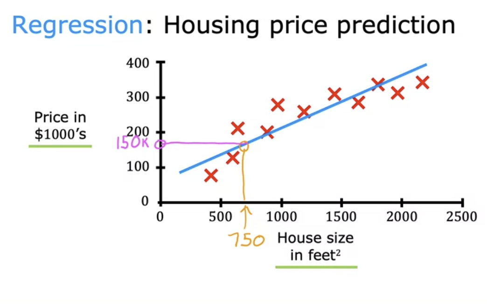
		- ### Classification
			- Instead of predicting a number like regression, classification predict categories, like malignient or beignine when predicting cancer
			- There can be be two or more categories.
			- 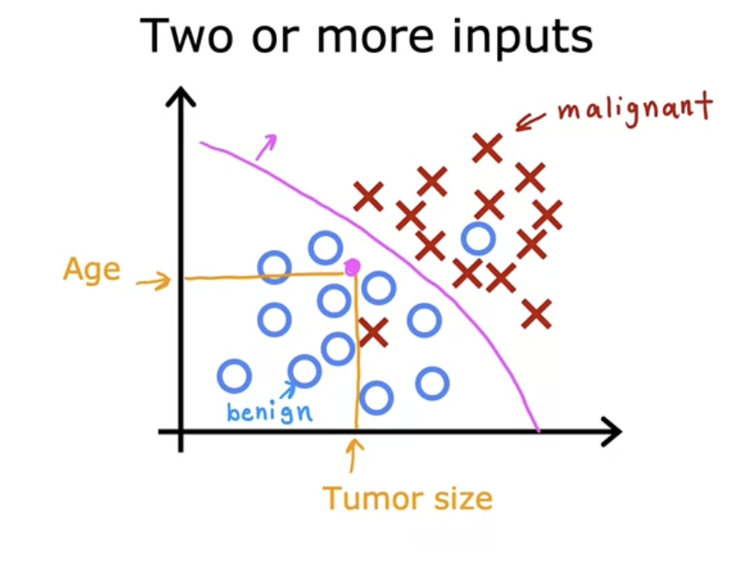
	- ## Unsupervised Learning
		- Unsupervised learning finds structure in unlabeled data, You don't give it the right answer
		- For example, grouping news articles into the same story or discovering marketing segments of customers
		- Clustering groups similar data together
		- Anomaly Detection is finding unusual data points
		- Dimensionality reduction compresses data using fewer numbers
	- ## Jupyter Notebooks
		- Environment to code and experiment with machine learning
- # Linear Regression Model
	- 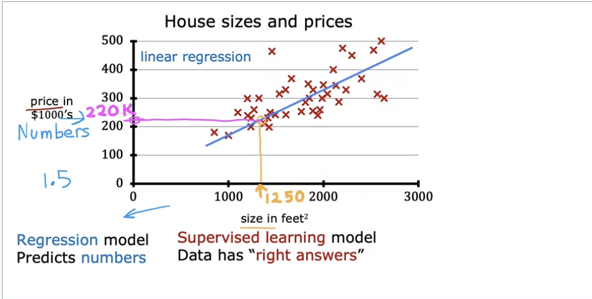
	- Linear regression model is fitting a straight line to your data
	- Example: predicting the price of the house based on the size of the house
	- Regression models predicts numbers
	- supervised learning model data has "right answers"
	- 
	  id:: 63dc7846-f4c2-44d4-8ad2-e1e4fb194d25
	- ## Terminology
		- 
		- ### Training Set
			- Data used to train the model
			- #### Notation
				- x = input variable, also called feature
				- y = output variable, also called target variable
				- m = number of training examples
				- (x,y) = single training example
				- $(x^{(i)}, y^{(i)})$ = ith training example, 1st, 2nd, third etc.
- # Regression Model
	- ## Linear Regression With One Variable
		- **Training set** includes input features and output targets
		- You feed the training set into the learning algorithm, and it produces a function, which takes a new input and output an estimate or prediction.
		- $f(x)=\hat{y}$
		- $\hat{y}$ is notation for a prediction, the estimated value of y
		- $y$ is the actual true value from the training set, called the output or target variable, whereas $\hat{y}$ is the prediction
		- The true price of your house is unknown until you sell it, for example
		- $f$ is called the model
		- How do we represent $f$? A straight line is one way
		- $f_{w,b}(x)=wx+b$
		  id:: 63bcaa99-69da-4bbe-aaac-f78cae481c4d
		- Simplified way of writing $f_{w,b}(x)$ is $f(x)$
		- You can also use curves instead of straight lines.
		- Another name for linear model with one variable is **univariate linear regression**
	- ## Model Representation Lab
		- NumPy is a popular library for scientific computing
		- Matplotlib is a popular library for plotting data
		- ### Python String Formatting
			- ```python
			  name = 'John'
			  age = 21
			  
			  # An example of an f-string
			  print(f'My name is {name} and I am {age} years old.')
			  
			  # Formatting with braces
			  print("I have {0} apples and {1} oranges".format(2, 3)) 
			  
			  2. Using the format function: 
			   "I have {} apples and {} oranges".format(2, 3)
			  ```
		- ### Matplotlib scatter plot
			- The function arguments `marker` and `c` show the points as red crosses (the default is blue dots).
			- ```python
			  import matplotlib.pyplot as plt
			  # Plot the data points
			  plt.scatter(x_train, y_train, marker='x', c='r')
			  # Set the title
			  plt.title("Housing Prices")
			  # Set the y-axis label
			  plt.ylabel('Price (in 1000s of dollars)')
			  # Set the x-axis label
			  plt.xlabel('Size (1000 sqft)')
			  plt.show()
			  ```
			- 
		- ### Matplotlib line plot
			- ```python
			  tmp_f_wb = compute_model_output(x_train, w, b,)
			  
			  # Plot our model prediction
			  plt.plot(x_train, tmp_f_wb, c='b',label='Our Prediction')
			  
			  # Plot the data points
			  plt.scatter(x_train, y_train, marker='x', c='r',label='Actual Values')
			  
			  # Set the title
			  plt.title("Housing Prices")
			  # Set the y-axis label
			  plt.ylabel('Price (in 1000s of dollars)')
			  # Set the x-axis label
			  plt.xlabel('Size (1000 sqft)')
			  plt.legend()
			  plt.show()
			  ```
			- 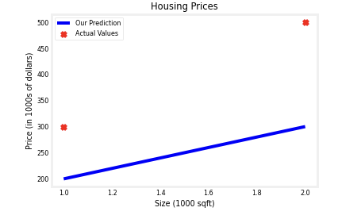
	- ## Cost Function
		- The cost function tells us how well the model is doing so we can get it to do it better
		- in model $f_{w,b}(x)$ $w,b$ are called coefficients or weights, also called the parameters of the model
		- Depending on the values wb, the function is different, which generates a different function on the graph
		- 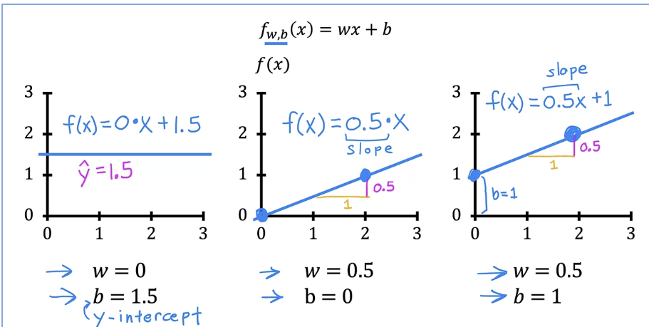
		- You want your line to fit the data, or mostly pass through it
		- When you have training data, for every $x^{(i)}$ there is a $y^{(i)}$ as well as a $\hat{y}^{(i)}$
		- We want to find $w,b$ so that for every $x^{(i)}$ there the predicted value $\hat{y}^{(i)}$ is close to the actual value $y^{(i)}$
		- ### Squared error cost function
			- Most common cost function for regression problems
			- $J(w,b) = \frac{1}{2n}\sum_{i=1}^{n}(\hat{y}^{(i)}- y^{(i)})^2$
			  id:: 63bcaa99-a838-4a22-99bc-0505d96cfa70
			- Also can be written as
			- $J(w,b) = \frac{1}{2n}\sum_{i=1}^{n}(f_{w,b}(x^{(i)}) - y^{(i)})^2$
			  id:: 63bd072e-7078-4c5f-ab08-c5cc6116a880
				-
	- ## Cost Function Intuition
		- We want to find values for $w,b$ that fit the training data
		- In other words, we want the line to go through the data points
		- We have a cost function, which shows us the difference between the model's predictions and the true values
		- our goal is to minimize find values $w,b$ that minimize the cost function
		- Let's simplify the linear regression model to $f_w(x)=w*x$, which is basically setting $b=0$ in the original equation
		- Our simplified cost function then looks like:
		- $J(w) = \frac{1}{2n}\sum_{i=1}^{n}(f_{w}(x) - y^{(i)})^2$
		- (no b, since it's just 0)
		- So now we just focus on minmizing $J(w)$
		- Let's graph the simplified model side by side with the cost function
		- $f_w(x)$ depends on the value of $x$ when sing a fixed $w$
		- $J(w)$ depends only on the value of w
		- Let's try calculating the cost when w=1
		- $f_w(x)=1*x$
		- Which basically means $y=x$
		- $J(w) = \frac{1}{2n}\sum_{i=1}^{n}(w*x^{(i)} - y^{(i)})^2$
		- 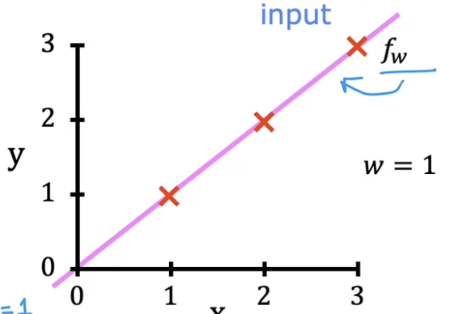
		- Some test values from the dataset could be $(0,0),(1,1),(2,2), (3,3)$
		- In each of these $(w*x^{(i)} - y^{(i)})=0$
		- $J(w) = \frac{1}{2m}(0^2+0^2+0^2)$
		- So for this dataset, when $w=1$ the cost is 0
		- We can plot the cost function as well
		- In the cost function graph, $J(w)$ (the cost) is the y axis and $w$ is the x axis
		- In this example, when $w=1$ the cost is 0, so we can plot it
		- 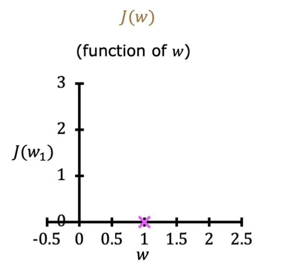
		- Now let's try w=.5
		- It misses most of the data points, so it has a higher error
		- 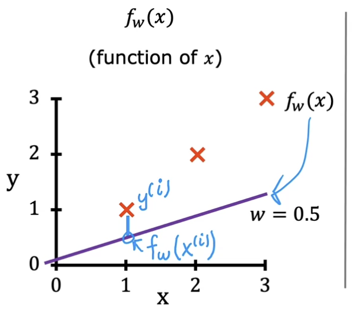
		- So our error is $(.5-1)^2+(1-2)^2 + (1.5 -3)^2) = 3.5$
		- Plugging into the cost function is $J(w) = \frac{1}{2*3}[3.5] = .58$
		- Let's plot the new cost .58
		- 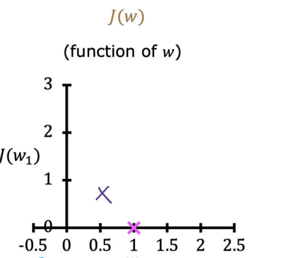{:height 480, :width 524}
		- Now let's try w=0
		- When w=0, then $f(x)=0$, a horizontal line at 0, on the x axis
		- So our cost function is  $J(w) = \frac{1}{2m}(1^2 + 2^2 + 3^2) = \frac{1}{6}[14] = 2.3$
		- We plot this cost function value where w=0
		- 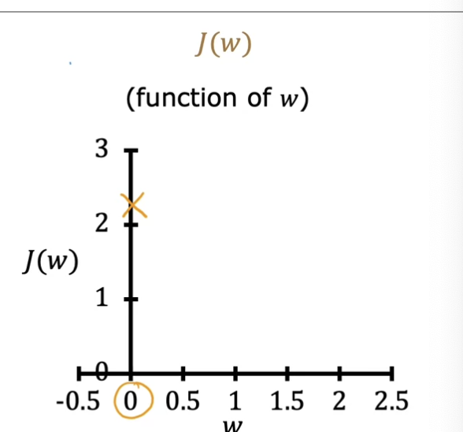
		- We can continue to plot these to trace what the cost function $J(w)$ looks like
		- 
		- How can we choose the value of w that fits the data best? We choose w to minimize the cost function $J(w)$
		- In this case, w=1 has the lowest cost
	- ## Visualizing the Cost Function
		- Before, we visualized the cost function using just one parameter, w and not b
		- It looked like this, and was a graph with the cost on the y axis, and the various values of w on the x axis.
		- 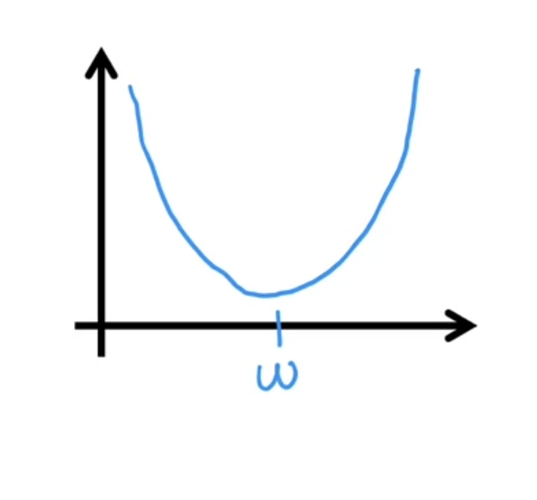
		- To visualize the cost function based on two different parameters, we have a 3d graph
		- 
		- Every point on the surface is a choice of w and b
		- Contour plot is another way of showing this
		- 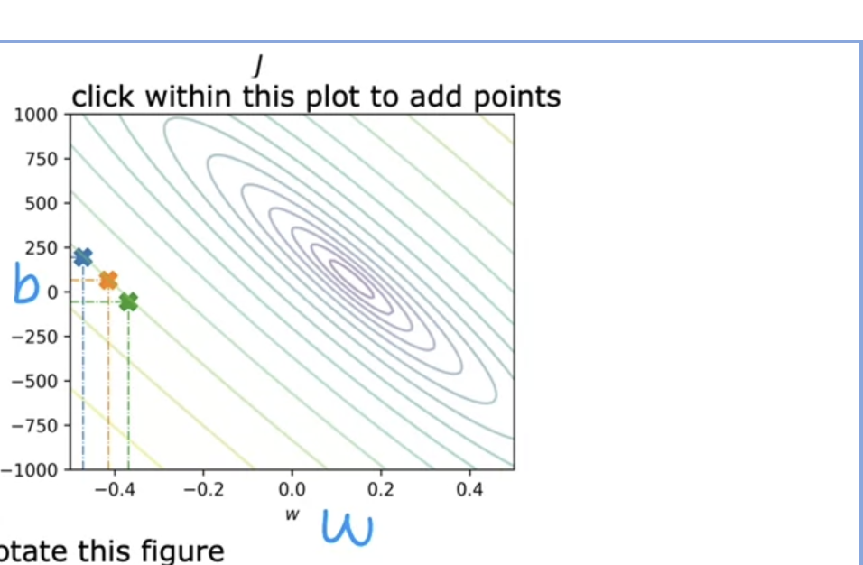
		- Within a band of the ellipse ellipse, the points are at the same height
		- The center has the lowest point
	- ## Cost function code
		- Our linear regression model is   $f_{w,b}(x^{(i)}) = wx^{(i)} + b$
		- This is the python code for this model
		- ```python
		  def compute_cost(x, y, w, b): 
		      """
		      Computes the cost function for linear regression.
		      
		      Args:
		        x (ndarray (m,)): Data, m examples 
		        y (ndarray (m,)): target values
		        w,b (scalar)    : model parameters  
		      
		      Returns
		          total_cost (float): The cost of using w,b as the parameters for linear regression
		                 to fit the data points in x and y
		      """
		      # number of training examples
		      m = x.shape[0] 
		      
		      cost_sum = 0 
		      for i in range(m): 
		          f_wb = w * x[i] + b   
		          cost = (f_wb - y[i]) ** 2  
		          cost_sum = cost_sum + cost  
		      total_cost = (1 / (2 * m)) * cost_sum  
		  
		      return total_cost
		  ```
	-
- # Gradient Descent
	- ## Gradient Descent Algorithm
		- $w=w-\alpha\frac{\partial}{\partial w}J(w,b)$
		- Update $w$, by taking the current w and update it a small amount
		- Note that `=` is an assignment in this context, like in programming, and not a mathemetical equality assertation.
		- $\alpha$ is the greek alphabet letter alpha. In this equation $\alpha$ is the learning rate
		- The learning rate ($\alpha$) is usually a small positive number between 0 and 1, for example .01
		- Alpha basically controls how big of a step you take down hill (in the 3d diagram)
		- $\frac{\partial}{\partial w}J(w,b)$ is the derivative (from calculus) of the cost function $J$
		- The model has two parameters, not just $w$ but also $b$, so we have a similar assignment operation
		- $b=b-\alpha\frac{\partial}{\partial b}J(w,b)$
		- For the gradient descent algorithm, you repeat both these equations until they converge
		- Converges means you reach a point at the local minimum where w and b no longer change with each additional step you take
		- You need to simultaneously update both paramaters
		- Don't update one and then the other.
		- You want the second update, for example updating b, to depend on the original value of w, and not the updated one.
		- Think about "saving it" in a tmp variable
		- $tmp_b=b-\alpha\frac{\partial}{\partial b}J(w,b)$
		- $tmp_w=w-\alpha\frac{\partial}{\partial w}J(w,b)$
		- $w=tmp_w$
		- $b=tmp_b$
	- ## Simplified Gradient Descent Example
		- The original equation was a "partial derivitive", which is the derivative of a function with more than one variable.
		- Consider a simplified form of gradient descent where we just minimize one parameter $w$, which is a regular derivative,
		- $w=w-\alpha\frac{d}{d w}J(w)$
		- We try to minimize the cost by adjust the parameter $w$ in $J(w)$
		- When using only one parameter, we can look at a 2d graph of $J(w)$ instead of a 3D graph.
		- 
		- We can initialize the gradient descent value with a value for $w$
		- 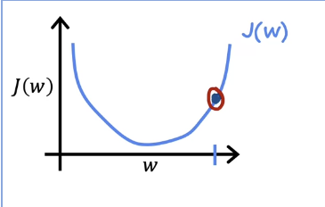
		- We can think of the derivative at this point by drawing a tangent line that touches the curve at the point
		- 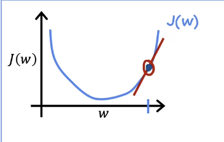
		- What does $\frac{d}{d w}J(w)$ mean?
		- The slope of this line is the derivative of $J(w)$ at this point, which we can find by drawing a triangle.
		- If we compute the height divided by width of the triangle, we can get the slope
		- 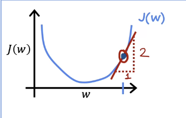
		- For example, the slope might be 2 over 1. When the tangent is pointed up and to the right, the slope is positive
		- So this means that $w=w-\alpha * (\text{positive number})$
		- When we subtract a positive number from $w$, we get a new value that's smaller
		- This means on the graph, we move to the left when we decrease the value of $w$
		- This makes sense because we can see we get closer to the minimum value of $J(w)$ when we make $w$ smaller
		- 
		- Let's look at another example, when we initialize the starting value to the left of the minimum
		- When we look at the tangent line of this point, the tangent line is down and to the right, so the derivative is negative.
		- 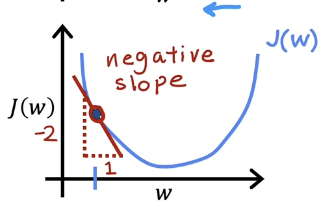
		- In this case we're subtracting a negative number $w=w-\alpha * (\text{negative number})$
		- This means that the value for $w$ becomes greater and we move to the right.
		- Once again this makes sense because making $w$ larger is bringing the value of $J(w)$ closer to the minimum value.
		- 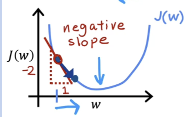
	- ## Learning rate $\alpha$
		- Simplified gradient descent $w=w-\alpha\frac{d}{d w}J(w)$
		- How to we choose a value for $\alpha$
		- If the learning rate is too small, we take very small baby steps, and it takes many steps to make it to the minimum. The process will be slow, but it will make it to the minimum eventually
		- If the learning rate is too large, we can overshoot the minimum, and a step could make the cost worse. We could keep overshooting back and forth and might never reach the minimum. In other words gradient descent may never "converge"
		- What if we have multiple minimums, with a local minimum and also an even lower global minimum?
		- 
		- If we're at a local minumum, the slope of the tangent line, $\frac{d}{d w}J(w)$ is 0
		- 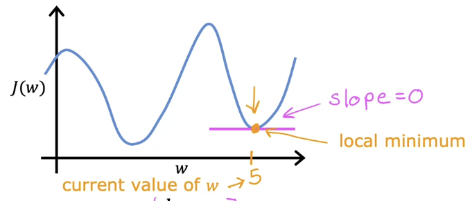
		- So our function would be $w=w-\alpha*0$
		- This means if we're already at a local minimum, the value of $w$ won't change
		- Further gradient descent steps do nothing and won't change the value of $w$
		- As we do gradient descent, when we approach the local minimum, the update steps get smaller and smaller.
		- 
	- ## Gradient descent for linear regression
		- The linear regression model is ((63bcaa99-69da-4bbe-aaac-f78cae481c4d))
		- The squared error cost function is ((63bd072e-7078-4c5f-ab08-c5cc6116a880))
		- The gradient descent algorithm is:
			- $w=w-\alpha\frac{\partial}{\partial w}J(w,b)$
			- $b=b-\alpha\frac{\partial}{\partial b}J(w,b)$
			- Repeating until convergence
		- If you calculate these derivatives, you get
			- id:: 63ca5105-a634-4e43-a44c-0b7607724217
			  $$\frac{\partial}{\partial w}J(w,b)  = \frac{1}{n}\sum_{i=1}^{n}(f_{w,b}(x^{(i)} - y^{(i)})x^{(i)}$$
			- id:: 63ca5105-103e-460b-93d6-1371828893da
			  $$\frac{\partial}{\partial b}J(w,b)  = \frac{1}{n}\sum_{i=1}^{n}(f_{w,b}(x^{(i)} - y^{(i)})$$
			- These are derived using calculus
		- ### Derivation of gradient descent algorithm
			- $$\frac{\partial}{\partial w}J(w,b)=$$
			- $$\frac{\partial}{\partial w}\frac{1}{2n}\sum_{i=1}^{n}(f_{w,b}(x^{(i)} - y^{(i)})^2=$$
			- $$\frac{\partial}{\partial w}\frac{1}{2n}\sum_{i=1}^{n}(wx^i+b-y^{(i)})^2$$
			- Now we compute the partial derivative with respect to $w$
			- $\frac{\partial}{\partial w}(wx^i+b-y^{(i)})^2 = 2(wx^i+b-y^{(i)})x^i$
			- This two "cancels out the two to the left of the summation. We added this one half to make the equation simpler because we can cancel it out
			- $$\frac{1}{\cancel{2}n}\sum_{i=1}^{n}(wx^i+b-y^{(i)})\cancel{2}x^i$$
			- $$\frac{1}{n}\sum_{i=1}^{n}(wx^i+b-y^{(i)})x^i$$
			- The final equation
			- $$\frac{1}{n}\sum_{i=1}^{n}(f_{w,b}(x^{(i)} - y^{(i)})x^{(i)}$$
			- We can do the same for
			- $$\frac{\partial}{\partial b}J(w,b)$$
			-
			- Gradient descent can lead to a local minimum if there are diffirent minimums
			- Squared cost error function has a bowl shape, a convex function, so there will be no local minimum, only a single global minimum
			-
	- ## Running gradient descent
		- Plotting the line along data with various cost functions of w and b
		- You can see the cost functions near the center circle match the data better
		- 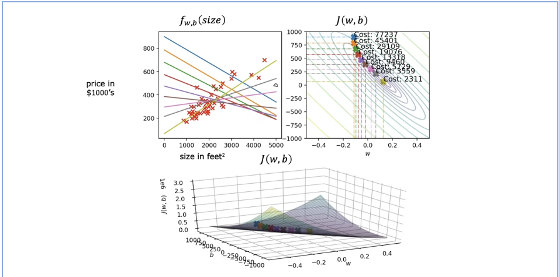
		- ### Batch gradient descent
			- Every step of gradient descent uses all the training samples at each update
			- We're computing the error across all examples
			- There are other versions of gradient descent that look at subsets of the training data
	- ## Implement Gradient Descent
		- You will implement gradient descent algorithm for one feature. You will need three functions.
			- `compute_gradient`
			- `compute_cost
			- `gradient_descent`,
		- ### Compute cost
			- ```python
			  def compute_cost(x, y, w, b):
			     
			      m = x.shape[0] 
			      cost = 0
			      
			      for i in range(m):
			          f_wb = w * x[i] + b
			          cost = cost + (f_wb - y[i])**2
			      total_cost = 1 / (2 * m) * cost
			  
			      return total_cost
			  ```
		- ### Compute Gradient
			- ((63ca5105-a634-4e43-a44c-0b7607724217))
			- ((63ca5105-103e-460b-93d6-1371828893da))
			- Returns both of these equations as a tuple:
			- ```python
			  def compute_gradient(x, y, w, b): 
			      """
			      Computes the gradient for linear regression 
			      Args:
			        x (ndarray (m,)): Data, m examples 
			        y (ndarray (m,)): target values
			        w,b (scalar)    : model parameters  
			      Returns
			        dj_dw (scalar): The gradient of the cost w.r.t. the parameters w
			        dj_db (scalar): The gradient of the cost w.r.t. the parameter b     
			       """
			      
			      # Number of training examples
			      m = x.shape[0]    
			      dj_dw = 0
			      dj_db = 0
			      
			      for i in range(m):  
			          f_wb = w * x[i] + b 
			          dj_dw_i = (f_wb - y[i]) * x[i] 
			          dj_db_i = f_wb - y[i] 
			          dj_db += dj_db_i
			          dj_dw += dj_dw_i 
			      dj_dw = dj_dw / m 
			      dj_db = dj_db / m 
			          
			      return dj_dw, dj_db
			  ```
	- ### Gradient Descent
		- ```python
		  def gradient_descent(x, y, w_in, b_in, alpha, num_iters, cost_function, gradient_function): 
		      """
		      Performs gradient descent to fit w,b. Updates w,b by taking 
		      num_iters gradient steps with learning rate alpha
		      
		      Args:
		        x (ndarray (m,))  : Data, m examples 
		        y (ndarray (m,))  : target values
		        w_in,b_in (scalar): initial values of model parameters  
		        alpha (float):     Learning rate
		        num_iters (int):   number of iterations to run gradient descent
		        cost_function:     function to call to produce cost
		        gradient_function: function to call to produce gradient
		        
		      Returns:
		        w (scalar): Updated value of parameter after running gradient descent
		        b (scalar): Updated value of parameter after running gradient descent
		        J_history (List): History of cost values
		        p_history (list): History of parameters [w,b] 
		        """
		      
		      # An array to store cost J and w's at each iteration primarily for graphing later
		      J_history = []
		      p_history = []
		      b = b_in
		      w = w_in
		      
		      for i in range(num_iters):
		          # Calculate the gradient and update the parameters using gradient_function
		          dj_dw, dj_db = gradient_function(x, y, w , b)     
		  
		          # Update Parameters using equation (3) above
		          b = b - alpha * dj_db                            
		          w = w - alpha * dj_dw                            
		  
		          # Save cost J at each iteration
		          if i<100000:      # prevent resource exhaustion 
		              J_history.append( cost_function(x, y, w , b))
		              p_history.append([w,b])
		          # Print cost every at intervals 10 times or as many iterations if < 10
		          if i% math.ceil(num_iters/10) == 0:
		              print(f"Iteration {i:4}: Cost {J_history[-1]:0.2e} ",
		                    f"dj_dw: {dj_dw: 0.3e}, dj_db: {dj_db: 0.3e}  ",
		                    f"w: {w: 0.3e}, b:{b: 0.5e}")
		   
		      return w, b, J_history, p_history #return w and J,w history for graphing
		  ```