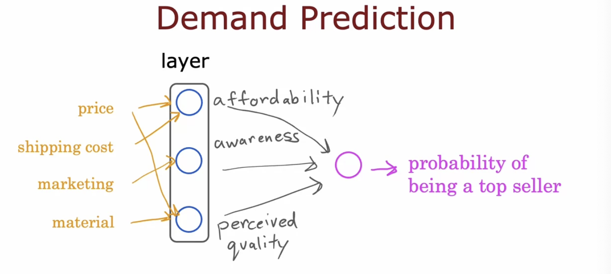
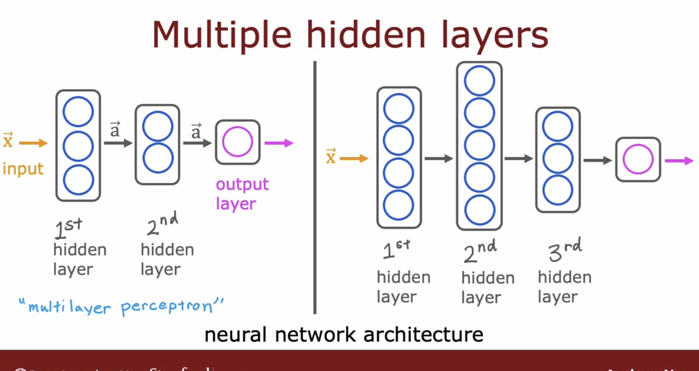
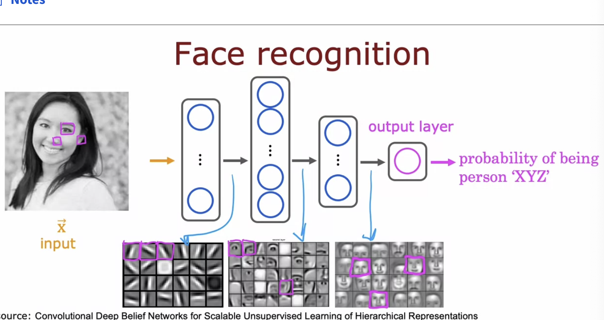
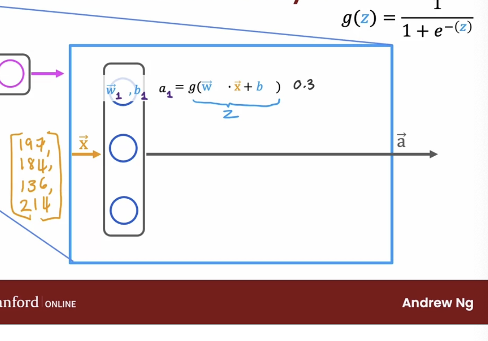
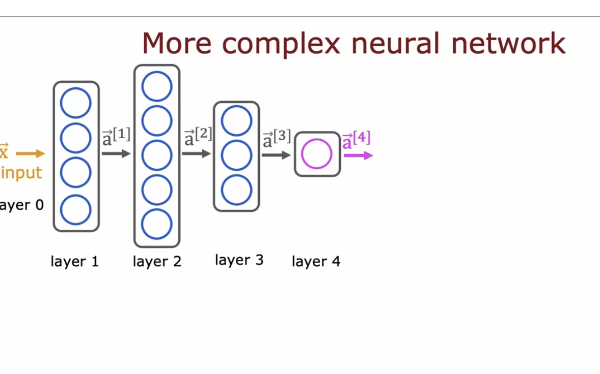
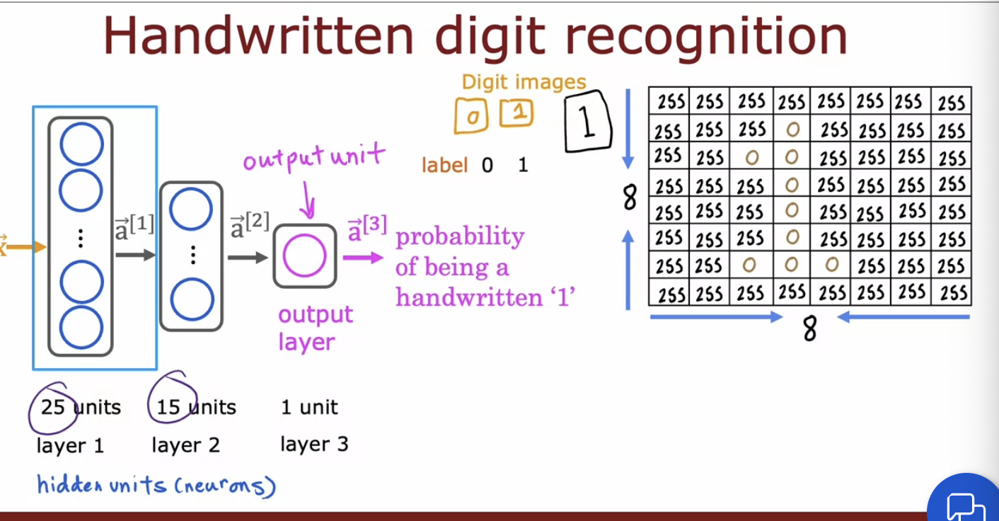
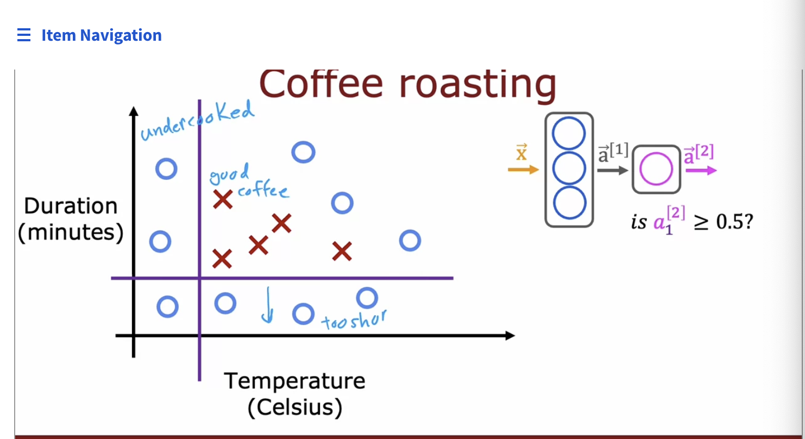
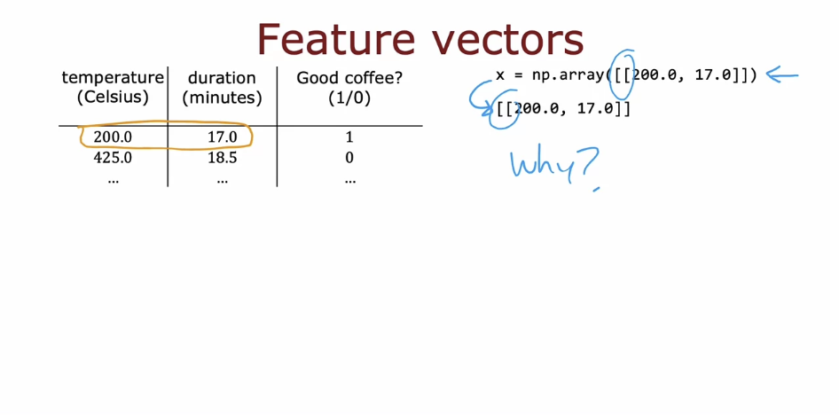
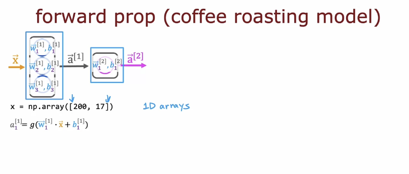
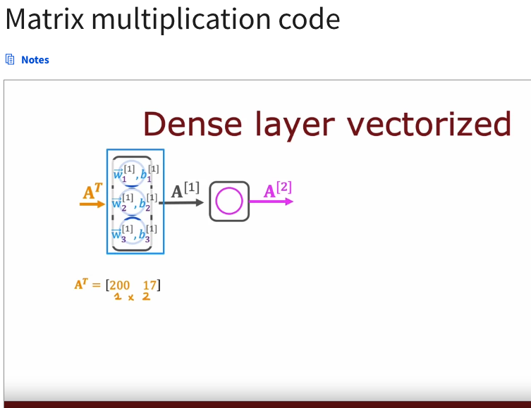

- # Intuition
	- Origin: algorithms that try to mimic the brain
	- Used in 1980s to early 1990s
	- fell out of favor in 1990s
	- resurgence in 2005, with deep learning
	- Applied to speech, images, and nlp
	- Neurons have inputs and receive inputs, then sends it output to other neurons
	- Why are they popular now?
		- We have tons more data now
		- In traditional algorithms, like linear regression or classification, they don't scale with additional data
		- larger neural networks can use massive data in a more effective way
		- Faster computer processors and GPUs also enables this
- # Demand Prediction
  collapsed:: true
	- Try to predict if a product will be a top seller
	- you have data of different t shirts at different prices, and if they were a top seller
	- Input is price
	- You could apply sigmoid function to classify
	- In this course, using term activation $a$ instead of $f(x)$
	- Can think of this sigmoid function as a single neuron. Can chain multiple together
	- ## Example
		- ### Inputs
			- price
			- shipping cost
			- marketing
			- material
		- Think about making three neurons
		- affordability, depends on price and shipping cost
		- Awareness is from marketing
		- Quality is from price and material
		- Group these neurons into a "layer"
		- 
		- layer can have multiple or single neurons
		- layer on the right is called an output layer
		- affordability, awareness, and perceived quality is activation
		- Inputs 4 numbers, middle layer computers 3 numbers, output layer computes 1 number
		- Input also called input layer
		- Instead of deciding which neurons are affected by each window layer
		- Each neuron in the middle, has access to every value from the previous layer
		- So in this model, affordability will see every variable, but should learn to focus on subset of features, by adjusting weights
		- Each layer inputs a vector and outputs a vector
		- First layer is input layer
		- Middle layers are hidden layers
		- Last layer is output layer
		- You can think of this as logistic regression that learns its own features
		- Can have multiple hidden layers of different sizes
		- When building a neural network, you need to decide how many hidden layers and neurons per hidden layers
		- Also called multi layer perceptron
		- 
		-
- # Facial recognition
  collapsed:: true
	- May want to train neural network to take an image, and output a persons identity
	- A picture 1000x1000 grid, and intensity values
	- Input vector might be a 1M long vector (1000x1000)
	- What does this look like?
	- First layer might looking for edges or lines
	- Second layer is collection of lines, like eyes or nose
	- Third layer, aggregating parts of faces
	- 
- # Neural Network Model
	- Each neuron has its own weights and biases
	- 4 numbers are fed into a neural network with thre neurons
	- 
	- so they may output .3, .7, and .2
	- These outputs are then passed to a
	- Can denote layer number by $\vec{w}_1^{[1]}$
	- Output of layer 1 is input to layer 2
	- Output layer has a single neuron, and computes the activations from previous layers
	- 
	- Outputs a single value like .84
	- If you want a binary prediction, you can set a threshold of something like .5 to predict 1 or 0
	- ## More complex neural networks
		- 
		- Layer 0 is input layer
		- layer 1-3 are hidden layers
		- layer 4 is output layer
		- Don't "count" input layer 0 in size of network
		- $\vec{a}_1^{[3]}=g(\vec{w}_1^{[3]}\cdot \vec{a}^{[2]} + b_1^{[3]})$
		- This allows you to compute the activations of one layer based on the activations in the previous layer
	- ## Forward Propogation - predictions
		- Handwritten digit recognition
		- Images of 0 or 1
		- 8x8 image
		- Use a neural network of 2 hidden layers
		- 
		- Forward propogation, making predictions from left to right
		- Backpropagation is used for learning
		- Usually layers get smaller to the right
	- ## Tensorflow
		- Optimize roasting coffee
		- temperature and duration are the variables you control
		- This will use labels saying if it's good or bad coffee
		- 
		- ### Building model using tensorflow
			- `x=np.array([[200.0, 17.0]]`
			- `layer_1 = Dense(units=3, activation='sigmoid')`
			- `a1 = layer_1(x)`
			- `layer_2=Dense(units=1, activation='sigmoid')`
			- `a2=layer_2(a1)`
			- `layer_3 = Dense(units=1, activation='sigmoid')`
			- `a3 = layer_3(a2)`
		- ### Data in TensorFlow
			- Some inconsistencies between numpy and tensorflow
			- Let's say you have a dataset like this
			- 
				- Why does the data have double brackets?
				- 2x3 matrix
				- `x=np.array([[1,2,3],[4,5,6]])`
				- Matrix is 2d array of numbers
				- `x = np.array([[200,17]]) # [200,7] 1x2 `
				- `x = np.array([[200], [17]]) ` 2x 1 array
				- `x = np.array([200,17])` 1d vector, not 2d matrix
				- Before we used 1d vector to represent input vector
				- In tensorflow, we input using matrices, because it's more computationally efficient
				- layers give tf.Tensor datatype, same as matrix
				- Can convert back to numpy with `a1.numpy()`
			- Automatically converts into tensor type when passing in numpy array
		- ### Building a neural network
			- Before we saw explicitly making each layer, and passing data between layers
			- Instead, we can make a sequential neural network, tensorflow will string together for you
			- `layer_1 = Dense(units=3, activation='sigmoid')`
			  collapsed:: true
			- `layer_2=Dense(units=1, activation='sigmoid')`
			  collapsed:: true
			- `model = Sequential([layer_1, layer_2])`
			- Give it inputs and targets
			- `x = np.array ([[200.0, 17.0],
			  collapsed:: true
			  [120.0, 5.0],
			  [425.0, 20.0],
			  [212.0, 18.0]])`
			- `targets y = np. array ([1,0, 0, 1])`
			- `model.compile(...)` (will learn more about this later)
			- `model.fit(x,y)`
			- `model.predict(x_new)`
- # Neural Network Implementation in Python
	- ## Forward Propagation in a single layer
		- How to implement forward prop in a single layer?
		- 
		- `x = np.array([200,17])`
		- collapsed:: true
		  ```python
		  w1_1 = np.array([1,2])
		  b1_1 = np.array([-1])
		  z1_1 = np.dot(w1_1,x) + b1_1
		  a1_1 = sigmoid(z1_1)
		  ```
- # Vectorization
	- People have been able to make large neural networks because neural networks can be vectorized
	- ## For Loops
	  collapsed:: true
		- collapsed:: true
		  ```python
		  x = np.array([200, 17])
		  W = np.array([[1,-3,5],
		               [-2,4,-6]])
		  b = np.array([-1,1,2])
		  def dense(a_in, W, b):
		    units = W.shape[1]
		    a_out = np.zeros(units)
		    for j in range(units):
		      w = W[:,j]
		      z = np.dot(w,a_in) + b[j]
		      a_out[j] = g(z)
		    return a_out
		  ```
	- ## Vectors
	  collapsed:: true
		- main difference is inputs are 2d arrays
		- collapsed:: true
		  ```python
		  # 2d aray
		  X = np.array([[200, 17]])
		  W = np.array([[1, -3, 5],
		               [-2, 4, -6]])
		  B = np.array([[-1, 1, 2]])
		  
		  def dense(A_in, W,B):
		    Z = np.matmul(A_in, W) + B
		    A_out = g(Z)
		    return A_out
		  ```
	- (g is sigmoid function)
	- ## Matrix Multiplication
	  collapsed:: true
		- Dot product between two vectors
		- $\begin{bmatrix} 1 \\ 2 \end{bmatrix}  \begin{bmatrix} 3 \\ 4 \end{bmatrix} = (1 * 3) + (2 * 4) = 11$
		- $z=\vec{a} \cdot \vec{w}$
		- ### Transpose
			- You can use transpose to turn column vector into a row vector a = 12
				- collapsed:: true
				  $$ \begin{pmatrix} 1 \\ 2 \end {pmatrix}^T = 
				  \begin{pmatrix}
				  1 & 2
				  \end{pmatrix}
				  $$
				- If you multiply a transpose, it's the same as the dot product between a and w
				- $$z=\vec{a}^T\vec{w}$$
		- ### Multiply vector by matrix
			- Suppose $\vec{a} = \begin{bmatrix} 1 \\ 2 \end{bmatrix}$
			- So $\vec{a}^T = \begin{bmatrix} 1 & 2 \end{bmatrix}$
			- and $W = \begin{bmatrix} 3 & 5 \\ 4 & 6 \end{bmatrix}$
			- So $Z=\vec{a}^TW$
			- so $Z=[\vec{a}^T\vec{w}_1 \vec{a}^T\vec{w}_2]$
			- So we multiply the vector by the first column, take the sum, then the next column, and take the sum, so we get our result $Z = \begin{bmatrix} 11 & 17 \end{bmatrix}$
		- ### Matrix Matrix Multiplication
			- $A = \begin{bmatrix} 1 & -1 \\ 2 & -2 \end{bmatrix}$
				- $A^T = \begin{bmatrix} 1 & 2 \\ -1 & -2 \end{bmatrix}$
				- Lay columns on the side one at a time to transpose
				- $W = \begin{bmatrix} 3 & 5 \\ 4 & 6 \end{bmatrix}$
				- If you see a matrix think of columns, if you see transpose think rows being grouped together
				- TODO multiplication vs dot product
				- row1*col1 + row1*col2 ...
	- ## Matrix Multiplication Rules
	  collapsed:: true
		- $A = \begin{bmatrix} 1 & -1 & 0.1 \\ 2 & -2  & 0.2 \end{bmatrix}$
		  collapsed:: true
			- Think of the columns of this matrix as three vectors
			  collapsed:: true
		- $A^T = \begin{bmatrix} 1 & 2 \\ -1 & -2 \\ 0.1 & 0.2 \end{bmatrix}$
		  collapsed:: true
			- You get the transpose by taking the first column, laying it on the side, the taking the second column and laying them the side
			  collapsed:: true
		- $W = \begin{bmatrix} 3 & 5 & 7 & 9\\ 4 & 6 & 8 & 0 \end{bmatrix}$
		  collapsed:: true
			- Think of each column in W as a vector
			  collapsed:: true
		- $Z=A^TW$
		  collapsed:: true
			- W1 will influcne the first column of the result vector, W2 will affect second column, etc
			  collapsed:: true
			- $A^T$ will influence the values in the columns
			  collapsed:: true
			- How to compute upper left most element? In the first row and first column
			  collapsed:: true
			- Get the first row of $A^T$ and the first column of W and take the dot product
			  collapsed:: true
			- $(1 * 3) + (2 * 4) = 11$
			  collapsed:: true
		- collapsed:: true
		  $$\begin{bmatrix}
		  1 & 2\\ 
		  -1 & -2\\ 
		  0.1 & 0.2
		  \end{bmatrix}
		  \begin{bmatrix}
		  3 & 5 & 7 & 9\\ 
		  4 & 6 & 8 & 0
		  \end{bmatrix}
		  =
		  \begin{bmatrix}
		  11 & 17 & 23 & 9\\ 
		  -11 & -17 & -23 & -9\\ 
		  1.1 & 1.7 & 2.3 & 0.9
		  \end{bmatrix}$$
		- $A^T$ is a 3x2 matrix
		  collapsed:: true
		- W is a 2x 4 matrix
		  collapsed:: true
		- so the "inner" numbers must match
		  collapsed:: true
		- Columns of first matrix equal rows of second matrix
		  collapsed:: true
	- ## Matrix Multiplication Code
	  collapsed:: true
		- Vectorized implementation of neural network
		  collapsed:: true
		- collapsed:: true
		  ```python
		  AT=np.array([[1,2], 
		               [-1, -2], 
		               [0.1, 0.2]])
		  # can also take transpose
		  # AT= A.T
		  z = np.matmul(AT,W)
		  # can also use @ symbol Z = AT @ W
		  ```
		- 
		  collapsed:: true
		- collapsed:: true
		  ```python
		  AT = np.array([[200, 17]])
		  W = np.array([1, -3, 5],
		              [-2, 4, -6]])
		  b = np.array([[-1, 1, 2]])
		  
		  def dense(AT,w,b):
		    z = np.matmul(AT,W) + b
		    a_out = g(z)
		    return a_out
		  ```
	- collapsed:: true